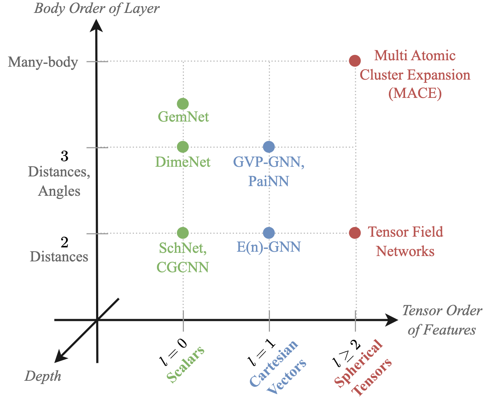

# ⚔️ Geometric GNN Dojo

*Geometric GNN Dojo* is a pedagogical resource for beginners and experts to explore the design space of **Graph Neural Networks for geometric graphs**.

Check out the accompanying paper ['On the Expressive Power of Geometric Graph Neural Networks'](https://arxiv.org/abs/2301.09308), which studies the expressivity and theoretical limits of geometric GNNs.
> Chaitanya K. Joshi*, Cristian Bodnar*, Simon V. Mathis, Taco Cohen, and Pietro Liò. On the Expressive Power of Geometric Graph Neural Networks. *NeurIPS 2022 Workshop on Symmetry and Geometry in Neural Representations.*
>
>[PDF](https://arxiv.org/pdf/2301.09308.pdf) | [Slides](https://www.chaitjo.com/publication/joshi-2022-expressive/Geometric_GNNs_Slides.pdf) | [Video](https://youtu.be/5ulJMtpiKGc)

❓**New to geometric GNNs:** try our practical notebook on [*Geometric GNNs 101*](geometric_gnn_101.ipynb), prepared for MPhil students at the University of Cambridge.

<a target="_blank" href="https://colab.research.google.com/github/chaitjo/geometric-gnn-dojo/blob/main/geometric_gnn_101.ipynb">
  
</a>

## Architectures

The `/src` directory provides unified implementations of several popular geometric GNN architectures:
- Invariant GNNs: [SchNet](https://arxiv.org/abs/1706.08566), [DimeNet](https://arxiv.org/abs/2003.03123)
- Equivariant GNNs using cartesian vectors: [E(n) Equivariant GNN](https://proceedings.mlr.press/v139/satorras21a.html), [GVP-GNN](https://arxiv.org/abs/2009.01411)
- Equivariant GNNs using spherical tensors: [Tensor Field Network](https://arxiv.org/abs/1802.08219), [MACE](http://arxiv.org/abs/2206.07697)
- 🔥 Your new geometric GNN architecture?

<figure><center></center></figure>

## Experiments

The `/experiments` directory contains notebooks with synthetic experiments to highlight practical challenges in building powerful geometric GNNs:
- `kchains.ipynb`: Distinguishing k-chains, which test a model's ability to **propagate geometric information** non-locally and demonstrate oversquashing with increased depth.
- `rotsym.ipynb`: Rotationally symmetric structures, which test a layer's ability to **identify neighbourhood orientation** and highlight the utility of higher order tensors in equivariant GNNs.
- `incompleteness.ipynb`: Counterexamples from [Pozdnyakov et al.](https://journals.aps.org/prl/abstract/10.1103/PhysRevLett.125.166001), which test a layer's ability to create **distinguishing fingerprints for local neighbourhoods** and highlight the need for higher order scalarisation.


## Installation

```bash
# Create new conda environment
conda create -n pyg python=3.8
conda activate pyg

# Install PyTorch (Check CUDA version!)
conda install pytorch==1.12.1 torchvision==0.13.1 torchaudio==0.12.1 cudatoolkit=11.3 -c pytorch

# Install PyG
conda install pyg -c pyg -c conda-forge

# Install other dependencies
pip3 install e3nn==0.4.4
conda install matplotlib pandas networkx
pip3 install ipdb ase
conda install jupyterlab -c conda-forge
```


## Directory Structure and Usage

```
.
├── README.md
|
├── geometric_gnn_101.ipynb             # A gentle introduction to Geometric GNNs
| 
├── experiments                         # Synthetic experiments
│   ├── incompleteness.ipynb            # Experiment on counterexamples from Pozdnyakov et al.
│   ├── kchains.ipynb                   # Experiment on k-chains
│   └── rotsym.ipynb                    # Experiment on rotationally symmetric structures
| 
└── src                                 # Geometric GNN models library
    ├── models.py                       # Models built using layers
    ├── gvp_layers.py                   # Layers for GVP-GNN
    ├── egnn_layers.py                  # Layers for E(n) Equivariant GNN
    ├── tfn_layers.py                   # Layers for Tensor Field Networks
    ├── modules                         # Layers for MACE
    └── utils                           # Helper functions for training, plotting, etc.
```


## Contact

Authors: Chaitanya K. Joshi (chaitanya.joshi@cl.cam.ac.uk), Simon V. Mathis (simon.mathis@cl.cam.ac.uk). 
We welcome your questions and feedback via email or GitHub Issues.


## Citation

```
@article{joshi2022expressive,
  title={On the Expressive Power of Geometric Graph Neural Networks},
  author={Joshi, Chaitanya K. and Bodnar, Cristian and  Mathis, Simon V. and Cohen, Taco and Liò, Pietro},
  journal={NeurIPS Workshop on Symmetry and Geometry in Neural Representations},
  year={2022},
}
```
